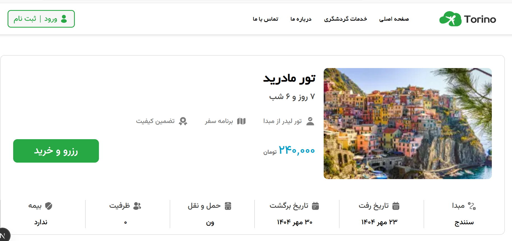

# Torino Travel Booking

**Torino** is a modern travel booking web application built with **Next.js 15** and **CSS Modules**. It allows users to explore and book tours, reserve tickets, and manage travel itineraries easily.

<p align="center">
  
</p>
<p align="center">
  
</p>
<p align="center">
  
</p>

---

## 🌟 Features

- Browse a variety of travel tours and packages
- Search and filter tours by location, date, or type
- Book tickets and manage reservations online
- Responsive design for mobile, tablet, and desktop
- Smooth UI/UX with modern React components
- Form validations for secure user input
- Toast notifications for successful actions

---

## 🛠️ Technologies

- [Next.js 15](https://nextjs.org/) – React framework for server-side rendering and static site generation
- [React](https://reactjs.org/) – Frontend library
- [CSS Modules](https://github.com/css-modules/css-modules) – Scoped and modular CSS
- [React Hook Form](https://react-hook-form.com/) – Form handling
- [Yup](https://github.com/jquense/yup) – Form validation
- [React Hot Toast](https://react-hot-toast.com/) – Notification system
- JSON Server (optional) – Mock API for development

---

## 🚀 Getting Started

1. **Clone the repository**

```bash
git clone https://github.com/Nazari-Fatemeh/Torino.git
cd torino-frontend
```
